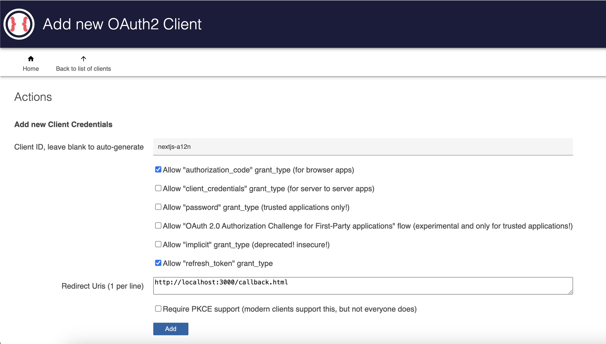

# pnpm workspace with @curveball/a12n-server and Next.js

This is a simple example of how to use `@curveball/a12n-server` with a Next.js project using the authorization code flow.

## Getting Started

From this repo root: 

`pnpm install` to install dependencies.

In separate Terminal tabs:

`pnpm start:server` to start server (will open at `http://localhost:8531/`) 

`pnpm start:client` Next will open at `http://localhost:3000/`

`pnpm lint` to lint all projects

From within project folders, running pnpm <command> from the respective `package.json` scripts will run the projects.

## Environment variables

In `client/.env` :
```
A12N_URL=http://localhost:8531 # Where your a12n-server is hosted
A12N_CLIENT_ID= # client id from your a12n-server
A12N_CLIENT_SECRET= # client id from your a12n-server
AUTH_SECRET= # `npx auth secret` or `openssl rand -hex 32`
```


## Setting up a12n-server

### Environment variables

To get started quickly, you can copy the default .env settings:

In `@curveball/a12n-server/.env` :
```
cp .env.example .env 
```

This will configure the server to use a sqlite database, which is fine for
dev environments, but not intended for production use.

After the server is started, head over to `http://localhost:8531/`, which will prompt you to create an admin user.

If you for whatever reason lock yourself out or forget your admin password, you can start over by deleting the
`a12nserver.sqlite` file.

## Register a new client-side web app on `@curveball/a12n-server`

For next-auth to work, you need to obtain a OAuth2 client id and secret. To quickly do this, you can open the
following URL in your browser, which should take you through all the steps. Make note of the `client_id` and
`client_secret` values, at the end of this process.

```
http://localhost:8531/app/new?nickname=MyNextApp&allowedGrantTypes=authorization_code,refresh_token&redirectUris=http://localhost:3000/api/auth/callback/a12n-server&url=http://localhost:3000/&clientId=nextjs-app
```


Our manually create the client by following the steps below:

1. Go to `http://localhost:8531/app/new` to register a new app as client. 



http://localhost:8531/app/:app_id/client

You will need to provide the:
- client name (this will become your `NEXTAUTH_CLIENT_ID`) 
- client URL (`NEXTAUTH_URL`). 

The client id is used in the client to authenticate with the server.

The URL is used to redirect the user back to the client after authentication.

1. You'll be directed to configure the client.


Select "authorization_code" and "refresh_token" as  grant types.

For valid redirect_urls make sure it includes: `http://localhost:3000/api/auth/callback/a12n-server`

1. Click "Save"

Your client is now registered and you can use the client id in your client-side app.

You can always change configurations by going to `http://localhost:8531/app/:app_id/client/:client_id/edit` or selecting Manage Clients from the `a12n-server` dashboard.

1. Update your `.env` file with `NEXTAUTH_CLIENT_ID` and `NEXTAUTH_CLIENT_SECRET` values.


# Related Reading

- On [migrating from next-auth 4 to 5](https://authjs.dev/getting-started/migrating-to-v5)

