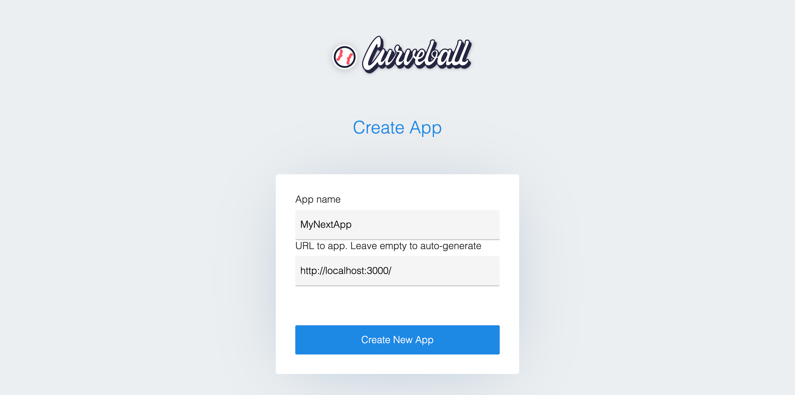
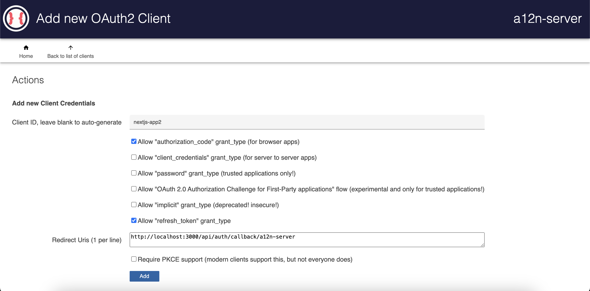
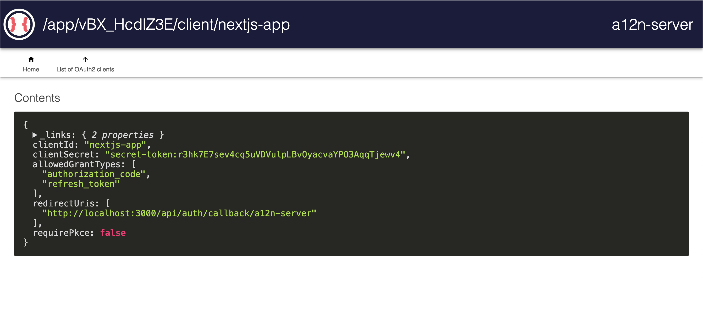

# @curveball/a12n-server and Next.js

This is a simple example of how to use `@curveball/a12n-server` with a Next.js project using:
- OAuth2 authorization code flow 
- OIDC 
- `next-auth@beta`/`authjs/dev` v5.

If you've been using `next-auth` v4, checkout their ["Upgrade Guide (NextAuth.js v5)"](https://authjs.dev/getting-started/migrating-to-v5).

Pre-requisites:
- `pnpm` 
- node >= 20

## Getting Started

### Install packages

From this workspace root: 

`pnpm install` to install dependencies.

pull the latest changes for the `@curveball/a12n-server` submodule:

```bash
# initialize and update the submodule
git submodule init
git submodule update --rebase
```

### Running Local Dev Environment

In separate Terminal tabs:

`pnpm start:server` to start server (will open at `http://localhost:8531/`) 

`pnpm start:client` will open Next at `http://localhost:3000/`

`pnpm lint` to lint all projects

From inside each project, running `pnpm <command>` for respective `package.json` scripts will also act on each project.

### Environment variables

`cp .env.local.example .env` to copy the default environment variables.

Note: you can delete `.env.local.example` or comment out all variables in `.env.local.example` to avoid namespace conflicts while running locally.

Environment variables prefixed with `AUTH_` are used by `authjs/next-auth`. See ["Environment Variable Inference"](https://authjs.dev/reference/nextjs#:~:text=next%2Dauth%40beta-,Environment%20variable%20inference,-NEXTAUTH_URL%20and%20NEXTAUTH_SECRET)


## Setting up a12n-server

### Environment variables

1. Generate the server env variables
`cd a12n-server`
`node ./bin/a12n-server`

This creates a .env with a JWT private key and also autostarts the server.

The default settings are configured to use a sqlite database, which is fine for dev environments, but not intended for production use.

2. Opening `http://localhost:8531` will prompt you to create an admin user. 

If you for whatever reason lock yourself out or forget your admin password, you can start over by deleting the `a12nserver.sqlite` file.

### Register a new client-side web app on `@curveball/a12n-server`

For next-auth to work, you need to obtain a OAuth2 client id and secret. 

To quickly do this, you can open the following URL in your browser, which should take you through all the steps. 

🗒️ Make note of the `client_id` and `client_secret` values, at the end of this process.

```
http://localhost:8531/app/new?nickname=MyNextApp&allowedGrantTypes=authorization_code,refresh_token
&redirectUris=http://localhost:3000/api/auth/callback/a12n-server&url=http://localhost:3000/&clientId=nextjs-app
```

Or manually create the client by following the steps below:

1. Go to `http://localhost:8531/app/new` to register a new app as client. 



You will need to provide the:
- client name (this will become known as the `nickname` on a12n-server) 
- client URL (`NEXTAUTH_URL`). 

The `client_id` is used in the client to authenticate with the server.

The client URL is used to redirect the user back to the client after authentication.

2. You'll be directed to configure the client.


  
Select "authorization_code" and "refresh_token" as  grant types.
  
For a valid `redirectUrl` make sure you entered: `http://localhost:3000/api/auth/callback/a12n-server`

1. Click "Add"

Your client is now registered and you can use the `clientId` and `clientSecret` in your client-side app.



Hang onto the values of `clientId` and `clientSecret` for the next step.

You can also add more apps by selecting "Manage Clients" from the `a12n-server` dashboard.

4. Update your `.env` file with: 
`AUTH_A12N_ID` with the value for `client_id` 
`AUTH_A12N_SECRET` with the `client_secret` value.

5. Restart your client and server to continue development.

## Maintenance

### Updating `@curveball/a12n-server` submodule

Note: this setup is intended for easy development and scaffolding. 
This is not a recommended setup for production environments.

For first-time setup

```bash
# For first-time setup:
# initialize and update the submodule
git submodule init
git submodule update --rebase

# For updates
# switch to the submodule directory
cd a12n-server
# pull the latest changes for the submodule
git pull origin main
```

If you made changes and want to commit them 

```bash
# return to root of project
cd ..
# add the submodule
git add a12n-server
git commit -m "Update submodule"
## this updates the submodule in the parent repo, 
## not the original @curveball/a12n-server
git push origin main
```
